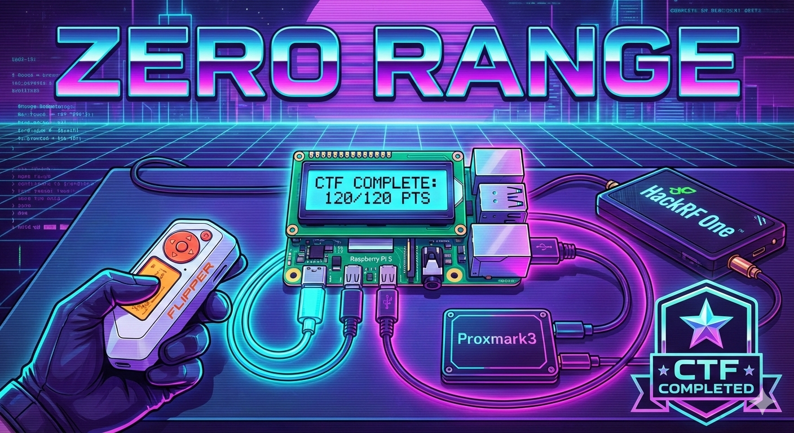

<p align="center">
  
  
  
</p>

<h1 align="center">ZeroRange</h1>

<p align="center">
  <strong>Flipper Zero Training System</strong><br>
  <em>Practice. Master. Repeat.</em>
</p>

<p align="center">
  A hands-on training platform to master Flipper Zero capabilities through gamified challenges.<br>
  Built on Raspberry Pi with an interactive LCD interface.
</p>

<p align="center">
  
</p>

---

## 📟 LCD Interface Preview

```
┌────────────────────────────────────┐
│  ╔════════════════════════════╗    │
│  ║ >iButton         25/120   ║    │
│  ║ U/D SEL=Go L=Bk           ║    │
│  ╚════════════════════════════╝    │
│                                    │
│      [▲]                           │
│  [◄] [●] [►]                       │
│      [▼]                           │
└────────────────────────────────────┘
```

Navigate through challenges using the 5-button interface:
- **▲ UP / ▼ DOWN** - Navigate menus
- **● SELECT** - Confirm selection
- **◄ LEFT** - Go back

---

## Challenges

### Currently Available

| Module | Challenges | Points | Status |
|--------|------------|--------|--------|
| **iButton** | Touch & Read, Clone, Emulate | 30 pts | Available |
| **NFC** | Detect, Clone, MIFARE Attack | 30 pts | Available |
| **RFID** | Detect, Clone, Simulate | 30 pts | Available |
| **SubGHZ** | Detect Signal, Record & Replay, Signal Analysis | 30 pts | Available |

**Total: 120 points** across 12 challenges

### Coming Soon

| Module | Description | Status |
|--------|-------------|--------|
| **IR** | Infrared signal challenges | In Development |

---

## Hardware Requirements

```
Raspberry Pi 5              Components
──────────────              ──────────
GPIO 2 (SDA)  ─────────────► Adafruit LCD (I2C)
GPIO 3 (SCL)  ─────────────►
5V / GND      ─────────────►

USB Port 1    ─────────────► iButton USB Reader (HID)
USB Port 2    ─────────────► Proxmark3 (NFC/RFID)
USB Port 3    ─────────────► HackRF One (SubGHZ)
```

**Components:**
- Raspberry Pi 5 (or Pi 4)
- Adafruit RGB LCD Shield 16x2
- iButton USB Reader (HID keyboard emulation)
- Proxmark3 (for NFC/RFID challenges)
- HackRF One (for SubGHZ challenges)
- Flipper Zero (your training tool)

---

## 🛒 Shopping List

> **Affiliate Disclaimer:** As an Amazon and AliExpress Associate, I earn from qualifying purchases. You will pay the same price, but I might earn a small commission — this helps finance the gear and support the development of ZeroRange. Thank you!

| Component | Amazon | AliExpress |
|-----------|--------|------------|
| **Raspberry Pi 5 (4GB)** | [Buy on Amazon](https://amzn.to/3O4jeX1) | — |
| **Adafruit i2c 16x2 RGB LCD Pi Plate** | [Buy on Amazon](https://amzn.to/4rGhYrK) | — |
| **Proxmark3** | [Buy on Amazon](https://amzn.to/4akFmDZ) | [Buy on AliExpress](https://s.click.aliexpress.com/e/_c3znHpUL) |
| **HackRF One** | [Buy on Amazon](https://amzn.to/4ttmuvs) | — |
| **HackRF + Porta Pack** | — | [Buy on AliExpress](https://s.click.aliexpress.com/e/_c3vH9LoF) |
| **iButton USB Reader** | — | [Buy on AliExpress](https://s.click.aliexpress.com/e/_c3KQ9ToL) |

---

## Quick Start

```bash
# Clone the repository
git clone https://github.com/samxplogs/ZeroRange.git
cd ZeroRange

# Install dependencies
pip3 install -r requirements.txt

# Run ZeroRange
python3 zerorange.py
```

For detailed installation instructions, see [INSTALLATION.md](INSTALLATION.md).

---

## Challenge Examples

### iButton - Touch & Read
```
╔════════════════════════════╗
║ Challenge 1               ║
║ Touch & Read              ║
╚════════════════════════════╝
         ↓
╔════════════════════════════╗
║ Waiting for key...        ║
║ Touch to reader           ║
╚════════════════════════════╝
         ↓
╔════════════════════════════╗
║ SUCCESS! +10pts           ║
║ Challenge Done!           ║
╚════════════════════════════╝
```

### NFC - Detect Card
```
╔════════════════════════════╗
║ NFC Challenge 1           ║
║ Detect any card           ║
╚════════════════════════════╝
         ↓
╔════════════════════════════╗
║ Scanning...               ║
║ Place card on PM3         ║
╚════════════════════════════╝
         ↓
╔════════════════════════════╗
║ FOUND: MIFARE 1K          ║
║ UID: 04:A3:F5:B2          ║
╚════════════════════════════╝
```

### SubGHZ - Record & Replay
```
╔════════════════════════════╗
║ SubGHz Ch2 [1/2]          ║
║ Press TX button           ║
╚════════════════════════════╝
         ↓
╔════════════════════════════╗
║ Signal captured!          ║
║ Strength: -45dBm          ║
╚════════════════════════════╝
         ↓
╔════════════════════════════╗
║ SOLVED! +10pts            ║
║ Signal replayed!          ║
╚════════════════════════════╝
```

---

## Features

- **Gamified Learning** - CTF-style challenges with points and progression
- **Real Hardware** - Practice on actual RFID/NFC/iButton systems
- **Score Tracking** - SQLite database tracks your progress
- **Auto-start** - Systemd service for standalone operation
- **WiFi Hotspot** - Connect directly to ZeroRange without network

---

## Project Structure

```
ZeroRange/
├── zerorange.py          # Main application
├── lcd_manager.py        # LCD display control
├── database.py           # Score persistence
├── config.json           # Configuration
│
├── ibutton_handler.py    # iButton challenge logic
├── nfc_handler.py        # NFC challenges (Proxmark3)
├── rfid_handler.py       # RFID challenges (Proxmark3)
├── proxmark_handler.py   # Proxmark3 interface
├── subghz_handler.py     # SubGHZ challenges (HackRF)
├── hackrf_handler.py     # HackRF One interface
│
├── SUBGHZ_INTEGRATION.md # SubGHZ setup guide
└── docs/                 # Web documentation
```

---

## Legal Notice

ZeroRange is designed for **educational purposes only** in a **controlled environment**.

Only practice on hardware you own or have explicit permission to test. Never use these skills on systems without authorization.

---

## License

This project is licensed under **CC BY-NC-SA 4.0** (Creative Commons Attribution-NonCommercial-ShareAlike 4.0).

- **Attribution** - You must give appropriate credit
- **NonCommercial** - No commercial use
- **ShareAlike** - Derivatives must use the same license

See [LICENSE](LICENSE) for details.

---

## Contributing

Contributions welcome! Please:
1. Fork the repository
2. Create a feature branch
3. Test on real hardware
4. Submit a pull request

---

## Credits

Created by **samxplogs**

- GitHub: [@samxplogs](https://github.com/samxplogs)
- YouTube: [@samxplogs](https://youtube.com/@samxplogs)

Built for the Flipper Zero community.

---

<p align="center">
  <strong>Practice. Master. Repeat.</strong>
</p>
